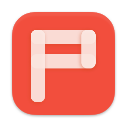
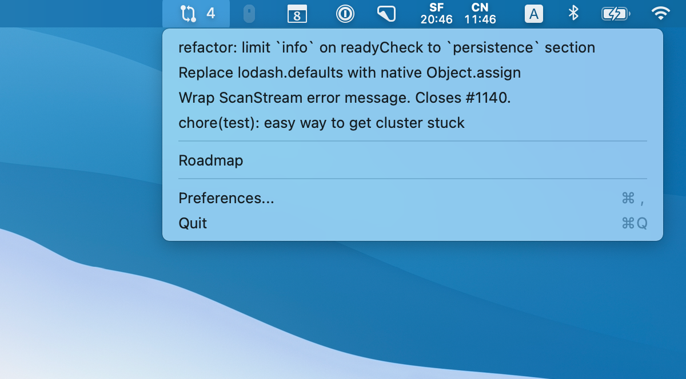

# OhMyPullRequests
🚀 See your actionable GitHub pull requests from the menu bar.

It shows pull requests that require your attention:

1. Review is requested from you.
2. Pull requests you opened that have no assigned reviewer, or one of the reviewers have approved.



## Usage

1. Download the app from the [release page](https://github.com/luin/OhMyPullRequests/releases) (right‑click the downloaded file and choose "Open"), or build it yourself.
2. Click the app icon in your menu bar.
3. Choose "Preferences..." from the dropdown.
4. Enter your [GitHub personal access token (classic)](https://github.com/settings/tokens/new) with the "repo" scope.

## Settings

Settings are configured in the "Preferences..." menu as a JSON object. It supports two keys:

```json
{
  "repos": ["luin/ohmypullrequests"],
  "quickLinks": [
    {
      "title": "My Project",
      "url": "https://example.com"
    }
  ]
}
```

Where:

- **"repos"**: List of repositories or owners you care about. Use full names (e.g., `"luin/ohmypullrequests"`) or an owner prefix (e.g., `"luin"`) to include all repos under that owner. Leave it empty to list all pull requests you can access.
- **"quickLinks"**: List of custom bookmarks that appear in the dropdown.
